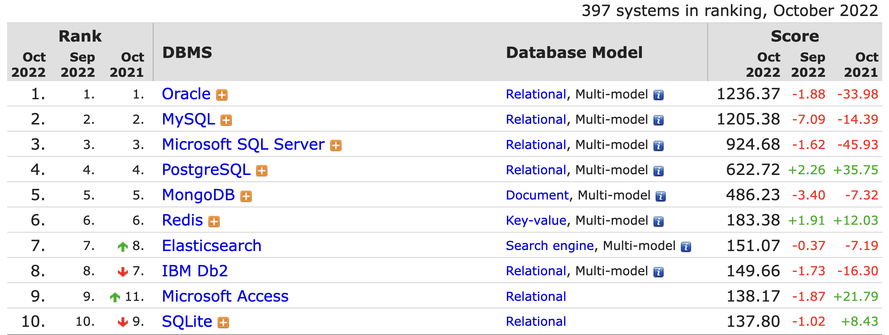

# T2A2 API WebServer Project
### 13410 CHANG-HA LEE

------------------------
<h1 align="center">  <b>LionWolf Haus  
POS system</b>   </h1>

### Welcome back to LionWolf Haus. The owner got impressed your task at the last time which is to solve new staffs get work and he wants you give another task.

####  **R1. Identification of the problem you are trying to solve by building this particular app.**

The owner of the restaurant wants to build a Point Of System for themselves. Previous system was from a third party company, and comes with many functions that won't need for this restaurant. The owner had to pay the whole price and it leads to wasting budget. 

The below is the basic functions that the client wants.

1. Add/delete staff using Authentication & Authorization.
   - As POS system should be related to budget, it's mandatory to have a strong authentication mechanism. URL might be exposed to the public depending on where the server'd be based, but to access to the Orders or Payments needs to be protected. 
2. Admin can make/delete Menu with price, ingredients, etc
   - By implementing Authorization, Admin can control the details of menu items. Ingredients will indicate simple details (due to the full ingredients will be displayed on the actual menu), what needs to be implemented in DB is `is_GF` and `is_DF` so that the waiting staff can guarantee it to customers before they put the order through.
3. Managing previous receipts
   - Storing previous transactions is important for the business in case of lots of other situations. The history is better to be stored in DBs rather than the app itself.
4. History of taking orders with staff id
   - Logging the history can make the process of transactions easier. It makes it quick to identify what happened during the service.
5. Reservation system
   - Most of reservation in restaurants need simple details from customers such as name, email, date and time. This can be implemented by a third party app, such as `NowBookit`, `Square`, `Opentable`, `The fork` and else.
6. and possibly more

####  **R2. Why is it a problem that need solving?**

The previous system came with lots of function. Some of them were good for this restaurant, but others could be wasting of computing resources and storage. For easy understanding, the restaurant has been paying 100% of the fee but using only 50% of the service. 

Since the third party company wants to raise the service fee up, even though the restaurant uses only couple of functions from the app, the service fee becomes wasting of budget. The restaurant wants to make their own simple system which can make the process simpler, faster and more efficient, further more, saving budget from unnecessary expense.

####  **R3. Why have you chosen this database system. What are the drawbacks compared to others?**

 [Image from 'DB-ENGINES'(https://db-engines.com/en/ranking)]

&nbsp;2022 current, Oracle is the most popular one followed by MySQL, Microsoft SQL Server then PostgreSQL in Relational database. Let's have a look which DBMS is the best option for this project. 

Oracle is Market-dominated company in DBMS for businesses. The main reason that Oracle can stay at the top of the rank always is Non-IT companies that can't have and manage their own IT team. Because Oracle can offer their clients very good stability and maintainability. These sound perfect for any companies that need the service, but it comes with expensive license fees.

MySQL is the most popular database in Open source. Currently it's merged into Oracle and partly paid service which means they can offer maintenance, backup and monitoring etc. It's cheaper fee than Oracle licenses so it could be a good option when a project needs good after service with a less expensive fee. However, developers worry about that Oracle would try to make MySQL just like Oracle itself, which is very less friendly to open source concepts.

The LionWolf POS system is based on **PostgreSQL**. It's an open source database system which is more unconstrained rather than Oracle that's mandatory of paid license. Thanks to it's an open source, it's more free from copyright problem when it comes to a profit-making business. And also, **PostgreSQL** sticks to the standard SQL vocabulary(ANSI) compared to **MySQL** that's another open source database system. This makes developers can build quicker and easier but also the app performs stronger when the query is more complex. But unfortunately, CRUD performance is less stronger than other RDBMSs. 

####  **R4. Identify and discuss the key functionalities and benefits of an ORM**

An Entity Relationship Diagram (ERD) is used for Data modeling of RDB. When a new project that will use RDBMS starts, you have to It has 2 types that one is conceptual ERD and logical ERD. 
